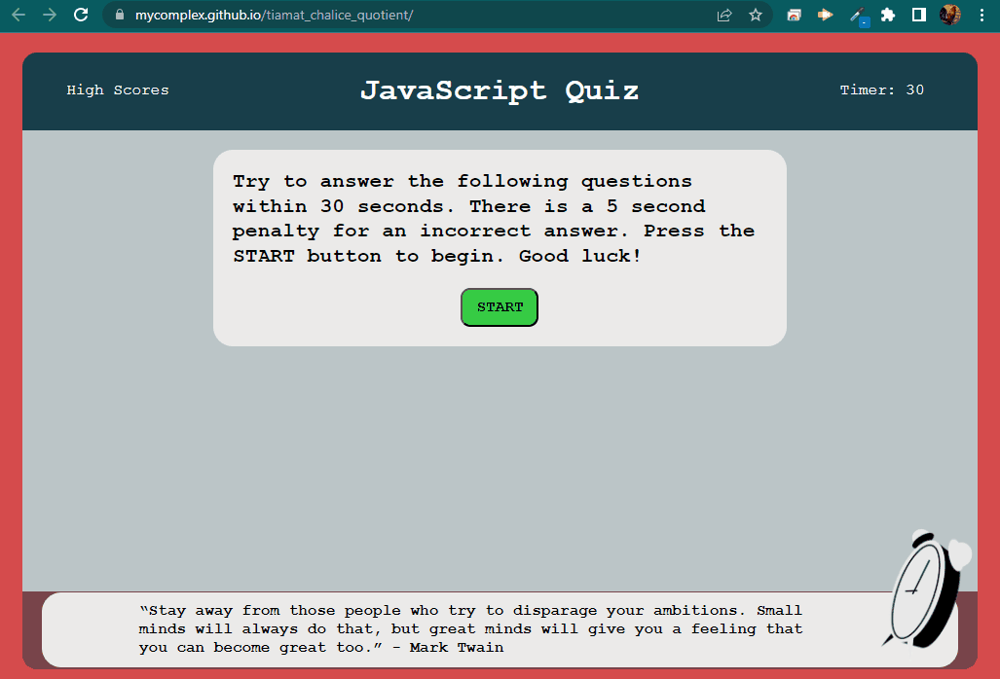

# JavaScript knowledge quiz 

## Table of Contents
- [Scope of Work](#scope-of-work)
- [Sample](#sample)
- [Live Website](#live-website)
- [Copyright](#copyright)

## Scope of Work
Build a timeed quiz that tests your JavaScript knowledge, applies a time penalty for a wrong answer, and records your score in a leaderboard.

## Sample

## Live Website
Browse to https://mycomplex.github.io/tiamat_chalice_quotient/ to review.

## Inspiration
Inspiration provided by: various web examples; generative pre-trained transformer type AI; and of course the instructor lectures, support of the TAs, and patience of my tutor.
